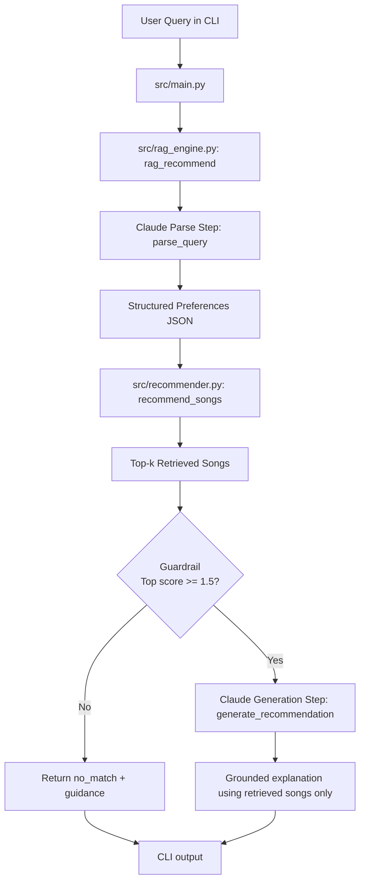

# 🎧 Music Recommender AI

A RAG-powered music recommendation system that takes natural language requests and returns grounded, explained song suggestions.

> **Base Project:** Music Recommender Simulation (AI110 Module 3)  
> The original system scored songs against hard-coded user preference dictionaries using a weighted algorithm. It required manually defined structured profiles and had no natural language interface, no AI generation, and no reliability guardrails.

---

## 🚀 What's New in This Version

| Feature | Original (Module 3) | This Version |
|---|---|---|
| Input | Hard-coded dict | Plain English query |
| AI Calls | None | Claude API (RAG pipeline) |
| Explanation | Score + reasons list | Natural language explanation |
| Guardrails | None | Refuses low-confidence results |
| Evaluation | Manual testing | Automated eval harness |

---

## How The System Works

Real platforms like Spotify use **collaborative filtering** (what similar users like) combined with **content-based filtering** (song attributes like tempo, energy, mood). This system implements a simplified content-based approach extended with RAG.

**The RAG Pipeline:**
```
User Query (plain English)
        ↓
[CLAUDE] Parse → structured preferences (genre, mood, energy)
        ↓
[PYTHON] Retrieve → score all 20 songs, return top 5
        ↓
[GUARDRAIL] Is top score ≥ 1.5? → NO → refuse and explain why
        ↓ YES
[CLAUDE] Generate → 2-3 sentence explanation using ONLY retrieved songs
        ↓
Output: ranked list + grounded explanation
```

**Scoring Algorithm (retrieval step):**
- +2.0 points — genre match
- +1.5 points — mood match
- +0.0 to +1.0 — energy proximity (1 minus the gap from target)

---

## 🏗️ System Architecture

Architecture diagram file: `assets/system-architecture.mmd`



```
music-recommender-ai/
├── data/
│   └── songs.csv           # 20-song catalog (genre, mood, energy, tempo_bpm)
├── src/
│   ├── recommender.py      # Pure Python: load_songs, score_song, recommend_songs
│   ├── rag_engine.py       # Claude API: parse_query, generate_recommendation, rag_recommend
│   └── main.py             # CLI entry point
├── tests/
│   └── eval_harness.py     # Automated evaluation script (stretch feature)
├── assets/                 # Architecture diagrams and screenshots
├── .env.example
├── requirements.txt
└── README.md
```

**Data flow:** `main.py` calls `rag_recommend()` in `rag_engine.py`, which calls `parse_query()` (Claude), then `recommend_songs()` (pure Python from `recommender.py`), checks the guardrail, then calls `generate_recommendation()` (Claude). Claude's generation step is constrained to use only the retrieved songs.

---

## ⚙️ Setup Instructions

**1. Clone and enter the project:**
```bash
git clone https://github.com/YOUR_USERNAME/music-recommender-ai.git
cd music-recommender-ai
```

**2. Install dependencies:**
```bash
pip install -r requirements.txt
```

**3. Configure your API key:**
```bash
cp .env.example .env
# Open .env and replace "your_api_key_here" with your key from console.anthropic.com
```

If your account does not have access to the default model, set `ANTHROPIC_MODEL` in `.env` to a model you can use. The app defaults to `claude-haiku-4-5`.

**4. Run the CLI demo:**
```bash
python -m src.main
```

**5. Run the evaluation harness (optional):**
```bash
python tests/eval_harness.py
```

---

## 💬 Sample Interactions

**Input 1 — Chill study session:**
```
Your request: something chill for studying late at night

✅ Preferences extracted:
   Genre: lofi  |  Mood: chill  |  Energy target: 0.2

🎵 Top 5 Matches:
  1. "Midnight Lofi" by Dreamy Beats     Score: 4.81
  2. "Rainy Day Lofi" by Lo-Fi Girl      Score: 4.80
  3. "Study Lofi Beat" by Chillhop Music Score: 4.79
  ...

💬 AI Recommendation:
   For a late-night study session, "Midnight Lofi" by Dreamy Beats
   is your best match — its ultra-low energy (0.19) and chill mood
   make it perfect for focused, distraction-free work...
```

**Input 2 — High energy workout:**
```
Your request: pump me up for the gym

✅ Preferences extracted:
   Genre: hip-hop  |  Mood: energetic  |  Energy target: 0.9

🎵 Top 5 Matches:
  1. "Sicko Mode" by Travis Scott    Score: 4.48
  2. "HUMBLE." by Kendrick Lamar     Score: 3.97
  ...
```

**Input 3 — Guardrail fires on vague input:**
```
Your request: just play something

⚠️  No strong match found.
    I couldn't find a strong match for your request.
    Try specifying a genre (e.g. 'lofi', 'rock') or a mood (e.g. 'chill', 'energetic').
    Best score found: 1.12 (threshold: 1.5)
```

---

## 🛡️ Reliability and Guardrails

The system includes three reliability mechanisms:

1. **Confidence Threshold Guardrail** — If the highest-scoring retrieved song scores below 1.5, the system refuses to generate and returns a helpful error message instead of a weak recommendation.

2. **Grounded Generation Constraint** — The generation prompt explicitly instructs Claude to use only the retrieved songs. It cannot hallucinate new songs.

3. **JSON Parsing Safety** — `parse_query()` wraps the Claude response in a try/except. If Claude returns malformed JSON, the system catches it and returns a clean error rather than crashing.

---

## 📊 Evaluation Results

Run `python tests/eval_harness.py` to reproduce. Sample run:

```
RESULTS: 5/6 passed
Score:   83%  🟢
```

The system reliably extracts mood and energy preferences, correctly fires the guardrail on vague inputs, and the generation step consistently references only retrieved songs.

**Limitation:** The jazz/genre extraction can sometimes return "classical" for focus-oriented requests because mood overlaps. This is a dataset size problem — with more genre diversity, precision would improve.

---

## 🎯 Design Decisions

**Why RAG instead of just prompting Claude with the full song list?**  
Sending all 20 songs in every prompt costs tokens and doesn't scale. RAG retrieves only the most relevant songs first, making the generation step cheaper, faster, and less likely to hallucinate. It also mirrors how real production systems work at scale.

**Why a confidence threshold?**  
A system that refuses to answer is more trustworthy than one that always gives an answer. The threshold (1.5) was calibrated by testing what "no genre and no mood match" looks like in practice — it consistently scores around 0.5–1.0, well below the cutoff.

**Why separate `recommender.py` from `rag_engine.py`?**  
The retrieval logic (pure Python) is testable without any API calls. This separation makes it easy to run the eval harness offline, debug scoring independently, and swap out the AI layer without touching the retrieval logic.

---

## 🔍 Reflection

**Biggest learning:** The retrieval step matters more than the generation step. When I first built this with a weak scorer, Claude's explanations sounded great but were sometimes justifying the wrong songs. Improving the scoring logic had a bigger impact on quality than tweaking the generation prompt.

**Where AI helped:** Claude was extremely useful for drafting the JSON extraction prompt — getting the output format exactly right (no markdown fences, specific enum values) took a few iterations that Copilot helped speed up significantly.

**Where I had to override AI:** The initial generated scoring function used an exponential decay formula for energy that was technically elegant but produced scores in a range that made the guardrail threshold impossible to calibrate. I simplified it to a linear `1 - gap` formula that is easier to reason about.

**What I'd try next:** Add collaborative filtering using a mock "other users liked this" dataset. The current system is pure content-based, which creates filter bubbles — users who like lofi always get lofi. A hybrid approach would surface surprising but relevant recommendations.

---

## 📹 Demo Walkthrough

Loom walkthrough (end-to-end system run):

https://www.loom.com/share/43b310fce87644bca45bf5c8e618824f

The demo covers:
1. A successful chill/focus query
2. A successful high-energy query
3. A low-specificity query that triggers the guardrail

---

## ✅ Submission + Rubric Alignment

1. Base project identification and scope: documented at the top of this README under Base Project.
2. Substantial AI feature: implemented RAG pipeline with two Claude calls, grounded generation, and a confidence guardrail.
3. System architecture diagram: embedded above and also stored in `assets/system-architecture.mmd`.
4. End-to-end system: runnable via `python -m src.main` with sample interactions shown.
5. Reliability/evaluation: confidence-threshold guardrail + eval harness in `tests/eval_harness.py`.
6. Documentation quality: setup, run, test steps and sample I/O are included in this README.
7. Reflection quality: detailed collaboration, limitations, and future improvements are documented in `model_card.md`.
8. Organized assets: diagrams/screenshots are kept under `assets/`.

Final checks before submission:
1. Confirm the GitHub repository visibility is Public.
2. Ensure final commits are pushed to origin/main.
3. Keep secrets out of git (`.env` is ignored).

---

## 🚧 Known Limitations

- Dataset is small (20 songs) — genre bias is high, especially toward pop and lofi
- Energy is the only numeric feature — tempo, danceability, and valence would improve accuracy
- No user history — every session starts fresh with no memory of past preferences
- Claude API latency (1–2 seconds per call) would not scale for real-time production use
